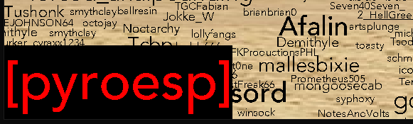
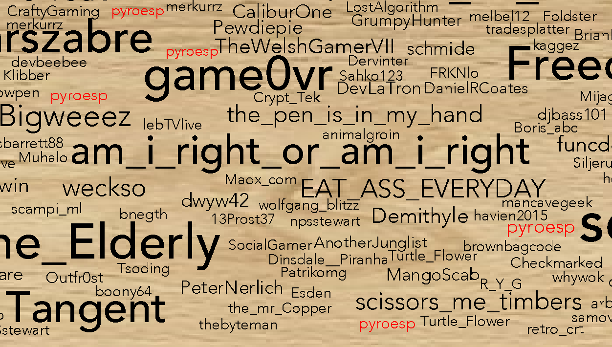

# Burn-the-Subs-and-Search

Render and Search names on oh_bother's Burn the Subs database

What is Burn The Subs: https://www.youtube.com/watch?v=e5zEBPPmbTo  
Oh_bother's Burn The Subs repo: https://github.com/WorkVerbDesign/Burn-the-Subs  
Oh_bother's Twitch (go subscribe): https://www.twitch.tv/oh_bother  

## Run the program

Unzip DB in the DB folder.  
You can get the latest DB here: https://github.com/WorkVerbDesign/Burn-the-Subs/tree/master/bts

Keep everything as is and use make to compile.
Run the exe without arguments.

**Note:** The program was made on win10 and so the makefile uses mingw.  
I don't think I've used anything windows specific so you should be able to compile for other OS.

## Features
Use your cursor to navigate through BTS.  

Use the scroll wheel or +/- to zoom in and out.

Press CTRL+S to save BTS to an uncompressed BMP. The uncompressed BMP is around 250MB big.  

Press CTRL+F to enable search mode. Write a name between the []. Press enter to finish the entry.  
The searched name changes to red.  
  

## Dependencies
- SDL2
- SDL_TTF
- SQLite
 
## Copyright & License

I own no copyright of any font, images, libraries or dlls used here.  

No license on my code, but SDL/SQLite/Other might have licenses.  

Let me know if anything distributed here violates any license or copyright and, after review, I will remove it.  
